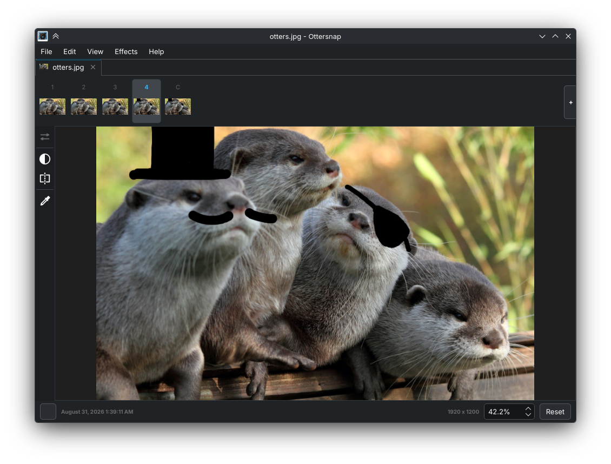

# Ottersnap - Snapshot Image Viewer

[](https://github.com/Kipwisp/ottersnap/actions/workflows/ci.yml)
[](LICENSE)

**Ottersnap** is a Qt6 image viewer that uses high-performance Vulkan rendering while automatically tracking and preserving image history. When you open an image file, it is watched for changes — make an update to the image, and the old state is snapshotted onto a timeline allowing you to keep a complete collection of the image's history.



> **Note:** Ottersnap is intended only for tracking changes to a working image — **it is not a backup solution**.

## Features

- **Image Timeline** — Versions of an image are saved to a timeline, allowing you to go back to any captured version.
- **Automatic Version Capture** — Images are monitored for live changes; on change, a new snapshot is added to the timeline.
- **Effects** — Adjust the view of the image using effects such as grayscale and mirroring.
- **Color Picking** — View dominant color clusters and pick colors from the image.

## Build & Run

### Prerequisites

- **CMake ≥ 3.17**
- **Qt 6.5+**
- **libzip**
- **libzstd**
- **glslc**

### Build

```bash
cmake -S . -B build
cmake --build build
```

### Flatpak Build

```bash
cd flatpak

# Build and run from the build sandbox
flatpak-builder --user --install-deps-from=flathub --force-clean --run \
  build-flatpak io.github.lutravox.Ottersnap.json

# Or export to a local repo and install into your user account
flatpak-builder --user --install-deps-from=flathub --force-clean \
  --repo=../repo build-flatpak io.github.lutravox.Ottersnap.json
flatpak remote-add --if-not-exists --user --no-gpg-verify ottersnap-local \
  "file://$(pwd)/../repo"
flatpak install --user ottersnap-local io.github.lutravox.Ottersnap
```

### Testing

```bash
cmake -S . -B build -DBUILD_TESTS=ON
cmake --build build
ctest --test-dir build
```

## License

This project is licensed under the [GNU General Public License v3](LICENSE).
